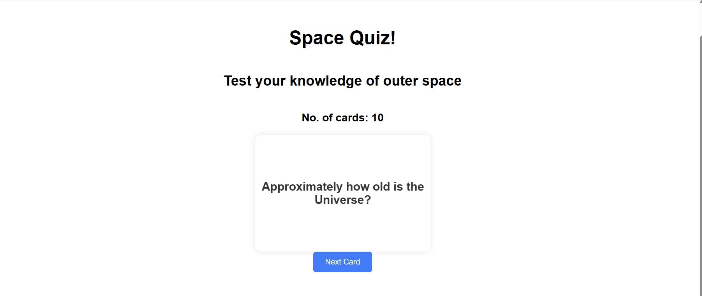

# Web Development Project 2 - *Solar Cards*

Submitted by: **Joel Jose**

This web app: **Flashcards about space facts**

Time spent: **6** hours spent in total

## Required Features

The following **required** functionality is completed:

- [v] **The title of the card set and some information about it, such as a short description and the total number of cards are displayed**
- [v] **A single card at a time is displayed, only showing one of the components of the information pair**
- [v] **A list of card pairs is created**
- [v] **Clicking on the card shows the corresponding component of the information pair**
- [v] **Clicking the next button displays a random new card**

The following **optional** features are implemented:

- [ ] Cards contains images in addition to or in place of text
- [ ] Cards have different visual styles such as color based on their category
  - [ ] *visual style implemented*

## Video Walkthrough

Here's a walkthrough of implemented required features:

GIF created with ScreenToGif

## Notes

There was difficulty tracking the usestate of flashcards to know when they were flipped or not

## License

    Copyright [2024] [Joel Jose]

    Licensed under the Apache License, Version 2.0 (the "License");
    you may not use this file except in compliance with the License.
    You may obtain a copy of the License at

        http://www.apache.org/licenses/LICENSE-2.0

    Unless required by applicable law or agreed to in writing, software
    distributed under the License is distributed on an "AS IS" BASIS,
    WITHOUT WARRANTIES OR CONDITIONS OF ANY KIND, either express or implied.
    See the License for the specific language governing permissions and
    limitations under the License.
